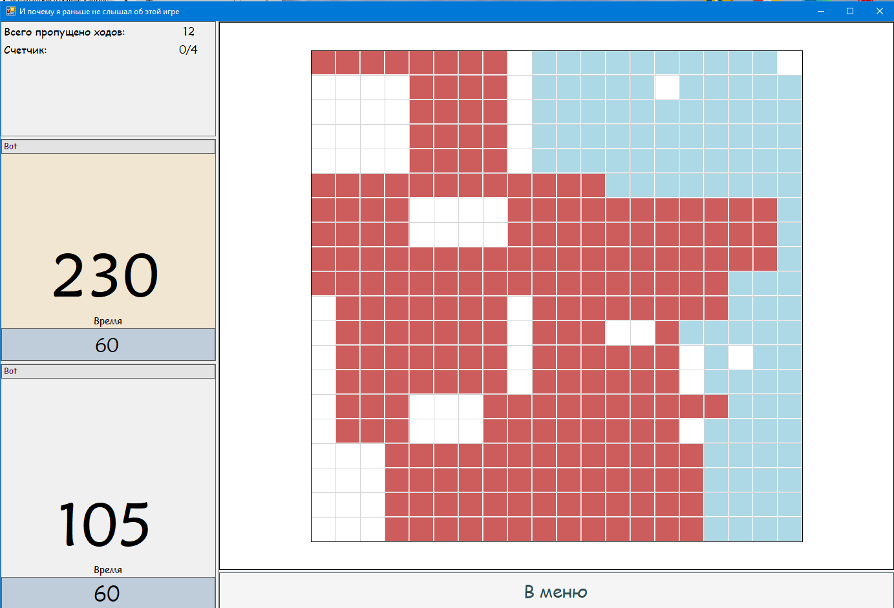

# RectsGame
Идея проекта — простая пошаговая игра для двух игроков, в которой они по очереди размещают прямоугольники на общем поле, бросая кубики. Главная цель — занять как можно большую площадь до завершения партии.

## Что реализовано
- [x] Основной игровой цикл
- [x] Броски кубиков и генерация размеров прямоугольников
- [x] Размещение прямоугольников на поле с проверками правил
- [x] Базовый интерфейс для игры
- [x] Игра с самописным ботом
- [x] Режим наблюдения за игрой двух ботов
- [x] Потоки для работы ботов
- [x] Реплеи со шкалой перевеса

## Особенности реализации
- Игровая механика с проверкой соприкосновений между прямоугольниками
- Простая, но работоспособная отрисовка поля и фигур
- Управление ботами через многопоточность
- Минимальный интерфейс для демонстрации и тестирования геймплея

## Статус проекта
Проект заброшен. Интерфейс черновой, без визуальных эффектов и анимаций, но подходит для игровых сессий. Реплеи требуют переработки, особенно по части метода сохранения. Онлайн-режим не реализован. Реализована только локальная игра против бота и демонстрация партий между двумя ботами. Логика размещения и подсчёт очков работают стабильно.

## Скриншоты
  
